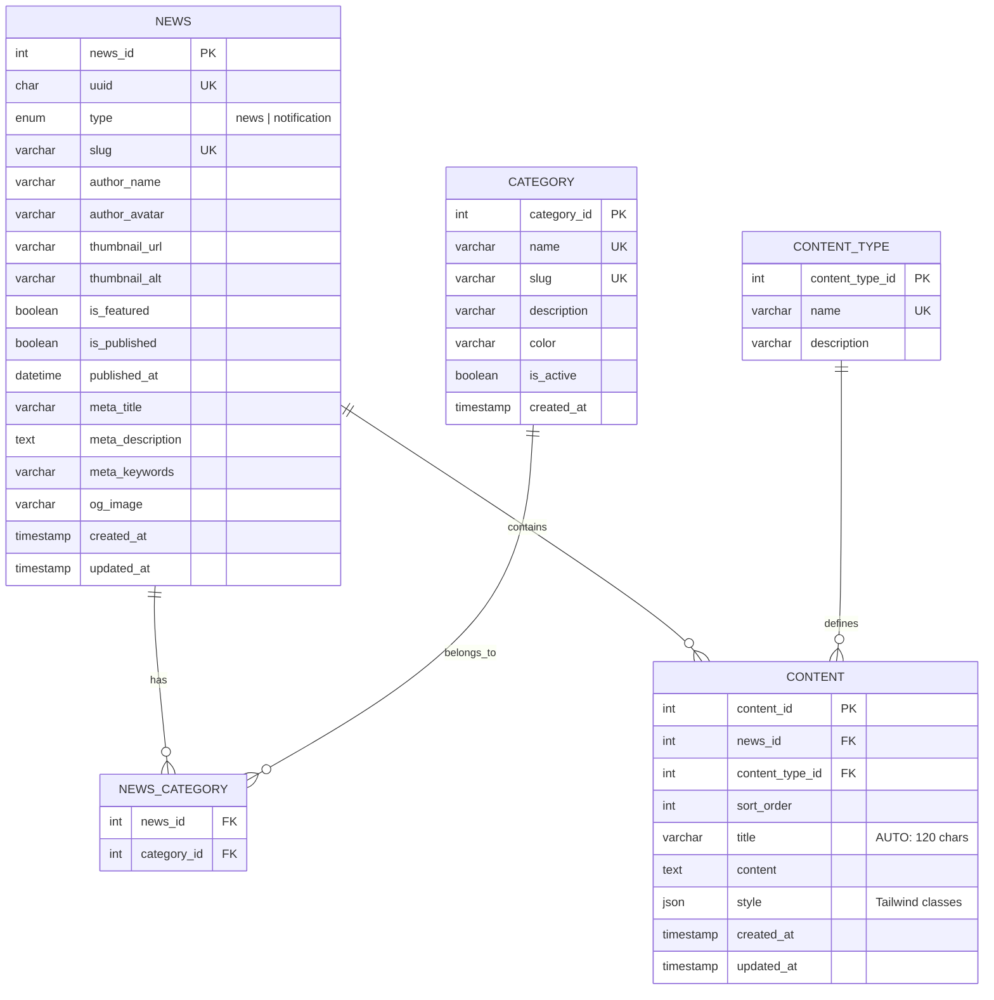

# Esquema de Migración: Slim PHP → Symfony con Doctrine

## Resumen Ejecutivo

Este documento describe la estructura de datos del microservicio de noticias implementado en Slim PHP y proporciona las directrices para su futura integración en el sistema principal basado en Symfony con Doctrine ORM.

**Versión:** 2.1 (Convención `underscore_number_aware`)

---

## 1. Modelo Entidad-Relación



---

## 2. Estructura de Base de Datos

### 2.1 Tabla: `content_type`
Tipos de contenido predefinidos para evitar inconsistencias.

| Campo | Tipo MySQL | Nullable | Default | Descripción |
|-------|------------|----------|---------|-------------|
| `content_type_id` | INT | NO | AUTO_INCREMENT | Clave primaria |
| `name` | VARCHAR(50) | NO | UNIQUE | Nombre del tipo |
| `description` | VARCHAR(255) | SÍ | NULL | Descripción del tipo |
| `created_at` | TIMESTAMP | NO | CURRENT_TIMESTAMP | Fecha de creación |

**Valores predefinidos:**
| content_type_id | name | description |
|-----------------|------|-------------|
| 1 | text | Bloque de texto plano o HTML |
| 2 | image | URL de imagen |
| 3 | video | URL de video (YouTube, Vimeo, etc.) |
| 4 | heading | Título o encabezado |
| 5 | quote | Cita o blockquote |
| 6 | list | Lista de elementos |
| 7 | code | Bloque de código |
| 8 | divider | Separador visual |
| 9 | embed | Contenido embebido genérico |
| 10 | file | Enlace a archivo descargable |

### 2.2 Tabla: `category`
Categorías predefinidas para clasificar noticias.

| Campo | Tipo MySQL | Nullable | Default | Descripción |
|-------|------------|----------|---------|-------------|
| `category_id` | INT | NO | AUTO_INCREMENT | Clave primaria |
| `name` | VARCHAR(100) | NO | UNIQUE | Nombre de categoría |
| `slug` | VARCHAR(100) | NO | UNIQUE | URL amigable |
| `description` | VARCHAR(255) | SÍ | NULL | Descripción |
| `color` | VARCHAR(7) | NO | '#3B82F6' | Color hex para UI |
| `is_active` | BOOLEAN | NO | TRUE | Categoría activa |
| `created_at` | TIMESTAMP | NO | CURRENT_TIMESTAMP | Fecha de creación |

### 2.3 Tabla: `news`
Noticias y notificaciones del sistema.

| Campo | Tipo MySQL | Nullable | Default | Descripción |
|-------|------------|----------|---------|-------------|
| `news_id` | INT | NO | AUTO_INCREMENT | Clave primaria |
| `uuid` | CHAR(36) | NO | UNIQUE | Identificador público |
| `type` | ENUM('news','notification') | NO | 'news' | Tipo de entrada |
| `slug` | VARCHAR(255) | NO | UNIQUE | URL amigable |
| `author_name` | VARCHAR(100) | SÍ | NULL | Nombre del autor |
| `author_avatar` | VARCHAR(500) | SÍ | NULL | Avatar del autor |
| `thumbnail_url` | VARCHAR(500) | SÍ | NULL | Imagen principal |
| `thumbnail_alt` | VARCHAR(255) | SÍ | NULL | Alt text |
| `is_featured` | BOOLEAN | NO | FALSE | Es destacado |
| `is_published` | BOOLEAN | NO | FALSE | Está publicado |
| `published_at` | DATETIME | SÍ | NULL | Fecha publicación |
| `meta_title` | VARCHAR(255) | SÍ | NULL | SEO: título |
| `meta_description` | TEXT | SÍ | NULL | SEO: descripción |
| `meta_keywords` | VARCHAR(500) | SÍ | NULL | SEO: keywords |
| `og_image` | VARCHAR(500) | SÍ | NULL | Open Graph image |
| `created_at` | TIMESTAMP | NO | CURRENT_TIMESTAMP | Fecha creación |
| `updated_at` | TIMESTAMP | NO | ON UPDATE | Última actualización |

**Índices:**
- `idx_type` → type
- `idx_published` → is_published, published_at
- `idx_featured` → is_featured
- `idx_uuid` → uuid

### 2.4 Tabla: `news_category` (N:M)
Relación muchos a muchos entre noticias y categorías.

| Campo | Tipo MySQL | Nullable | Default | Descripción |
|-------|------------|----------|---------|-------------|
| `news_id` | INT | NO | FK | Referencia a news |
| `category_id` | INT | NO | FK | Referencia a category |
| `created_at` | TIMESTAMP | NO | CURRENT_TIMESTAMP | Fecha de asignación |

**Clave primaria compuesta:** (news_id, category_id)

### 2.5 Tabla: `content`
Bloques de contenido de cada noticia.

| Campo | Tipo MySQL | Nullable | Default | Descripción |
|-------|------------|----------|---------|-------------|
| `content_id` | INT | NO | AUTO_INCREMENT | Clave primaria |
| `news_id` | INT | NO | FK | Noticia padre |
| `content_type_id` | INT | NO | FK | Tipo de contenido |
| `sort_order` | INT | NO | 0 | Orden de visualización |
| `title` | VARCHAR(120) | SÍ | AUTO | Primeros 120 chars |
| `content` | TEXT | SÍ | NULL | Contenido (texto/URL) |
| `style` | JSON | SÍ | NULL | Estilos Tailwind |
| `created_at` | TIMESTAMP | NO | CURRENT_TIMESTAMP | Fecha creación |
| `updated_at` | TIMESTAMP | NO | ON UPDATE | Última actualización |

**Triggers:**
- `content_auto_title_insert`: Auto-genera título desde primeros 120 chars
- `content_auto_title_update`: Actualiza título al modificar content

**Índice:** `idx_news_order` → news_id, sort_order

---

## 3. Mapeo de Convenciones de Nomenclatura

### 3.1 Mapeo de Nomenclatura BD → PHP

| Convención BD (snake_case) | Convención PHP (camelCase) |
|---------------------------|---------------------------|
| `news_id` | `$newsId` |
| `category_id` | `$categoryId` |
| `content_id` | `$contentId` |
| `content_type_id` | `$contentTypeId` |
| `sort_order` | `$sortOrder` |
| `is_published` | `$isPublished` |
| `is_featured` | `$isFeatured` |
| `is_active` | `$isActive` |
| `published_at` | `$publishedAt` |
| `thumbnail_url` | `$thumbnailUrl` |
| `author_name` | `$authorName` |
| `meta_title` | `$metaTitle` |
| `created_at` | `$createdAt` |
| `updated_at` | `$updatedAt` |

### 3.2 Tipos MySQL → Tipos Doctrine

| Tipo MySQL | Tipo Doctrine | Tipo PHP |
|-----------|--------------|----------|
| INT | `integer` | `int` |
| VARCHAR(n) | `string` (length=n) | `string` |
| TEXT | `text` | `string` |
| BOOLEAN | `boolean` | `bool` |
| JSON | `json` | `array` |
| DATETIME | `datetime` | `\DateTime` |
| TIMESTAMP | `datetime_immutable` | `\DateTimeImmutable` |
| ENUM | `string` + PHP Enum | `BackedEnum` |
| CHAR(36) UUID | `guid` | `string` |

---

## 4. Entidades Doctrine Propuestas

### 4.1 ContentType Entity

```php
<?php

namespace App\Entity;

use Doctrine\Common\Collections\ArrayCollection;
use Doctrine\Common\Collections\Collection;
use Doctrine\ORM\Mapping as ORM;

#[ORM\Entity(repositoryClass: ContentTypeRepository::class)]
#[ORM\Table(name: 'content_type')]
class ContentType
{
    #[ORM\Id]
    #[ORM\GeneratedValue]
    #[ORM\Column(name: 'content_type_id', type: 'integer')]
    private ?int $contentTypeId = null;

    #[ORM\Column(type: 'string', length: 50, unique: true)]
    private string $name;

    #[ORM\Column(type: 'string', length: 255, nullable: true)]
    private ?string $description = null;

    #[ORM\Column(type: 'datetime_immutable')]
    private \DateTimeImmutable $createdAt;

    #[ORM\OneToMany(mappedBy: 'contentType', targetEntity: Content::class)]
    private Collection $contents;

    public function __construct()
    {
        $this->contents = new ArrayCollection();
        $this->createdAt = new \DateTimeImmutable();
    }

    // Getters y Setters...
}
```

### 4.2 Category Entity

```php
<?php

namespace App\Entity;

use Doctrine\Common\Collections\ArrayCollection;
use Doctrine\Common\Collections\Collection;
use Doctrine\ORM\Mapping as ORM;

#[ORM\Entity(repositoryClass: CategoryRepository::class)]
#[ORM\Table(name: 'category')]
class Category
{
    #[ORM\Id]
    #[ORM\GeneratedValue]
    #[ORM\Column(name: 'category_id', type: 'integer')]
    private ?int $categoryId = null;

    #[ORM\Column(type: 'string', length: 100, unique: true)]
    private string $name;

    #[ORM\Column(type: 'string', length: 100, unique: true)]
    private string $slug;

    #[ORM\Column(type: 'string', length: 255, nullable: true)]
    private ?string $description = null;

    #[ORM\Column(type: 'string', length: 7, options: ['default' => '#3B82F6'])]
    private string $color = '#3B82F6';

    #[ORM\Column(type: 'boolean', options: ['default' => true])]
    private bool $isActive = true;

    #[ORM\Column(type: 'datetime_immutable')]
    private \DateTimeImmutable $createdAt;

    #[ORM\ManyToMany(targetEntity: News::class, mappedBy: 'categories')]
    private Collection $news;

    public function __construct()
    {
        $this->news = new ArrayCollection();
        $this->createdAt = new \DateTimeImmutable();
    }

    // Getters y Setters...
}
```

### 4.3 News Entity

```php
<?php

namespace App\Entity;

use App\Enum\NewsType;
use Doctrine\Common\Collections\ArrayCollection;
use Doctrine\Common\Collections\Collection;
use Doctrine\ORM\Mapping as ORM;
use Symfony\Component\Uid\Uuid;

#[ORM\Entity(repositoryClass: NewsRepository::class)]
#[ORM\Table(name: 'news')]
#[ORM\Index(columns: ['type'], name: 'idx_type')]
#[ORM\Index(columns: ['is_published', 'published_at'], name: 'idx_published')]
#[ORM\Index(columns: ['is_featured'], name: 'idx_featured')]
#[ORM\HasLifecycleCallbacks]
class News
{
    #[ORM\Id]
    #[ORM\GeneratedValue]
    #[ORM\Column(name: 'news_id', type: 'integer')]
    private ?int $newsId = null;

    #[ORM\Column(type: 'guid', unique: true)]
    private string $uuid;

    #[ORM\Column(type: 'string', length: 20, enumType: NewsType::class)]
    private NewsType $type = NewsType::NEWS;

    #[ORM\Column(type: 'string', length: 255, unique: true)]
    private string $slug;

    #[ORM\Column(type: 'string', length: 100, nullable: true)]
    private ?string $authorName = null;

    #[ORM\Column(type: 'string', length: 500, nullable: true)]
    private ?string $authorAvatar = null;

    #[ORM\Column(type: 'string', length: 500, nullable: true)]
    private ?string $thumbnailUrl = null;

    #[ORM\Column(type: 'string', length: 255, nullable: true)]
    private ?string $thumbnailAlt = null;

    #[ORM\Column(type: 'boolean', options: ['default' => false])]
    private bool $isFeatured = false;

    #[ORM\Column(type: 'boolean', options: ['default' => false])]
    private bool $isPublished = false;

    #[ORM\Column(type: 'datetime', nullable: true)]
    private ?\DateTime $publishedAt = null;

    // SEO
    #[ORM\Column(type: 'string', length: 255, nullable: true)]
    private ?string $metaTitle = null;

    #[ORM\Column(type: 'text', nullable: true)]
    private ?string $metaDescription = null;

    #[ORM\Column(type: 'string', length: 500, nullable: true)]
    private ?string $metaKeywords = null;

    #[ORM\Column(type: 'string', length: 500, nullable: true)]
    private ?string $ogImage = null;

    #[ORM\Column(type: 'datetime_immutable')]
    private \DateTimeImmutable $createdAt;

    #[ORM\Column(type: 'datetime_immutable')]
    private \DateTimeImmutable $updatedAt;

    // Relaciones
    #[ORM\ManyToMany(targetEntity: Category::class, inversedBy: 'news')]
    #[ORM\JoinTable(name: 'news_categories')]
    #[ORM\JoinColumn(name: 'id_news', referencedColumnName: 'id_news')]
    #[ORM\InverseJoinColumn(name: 'id_category', referencedColumnName: 'id_category')]
    private Collection $categories;

    #[ORM\OneToMany(mappedBy: 'parentNews', targetEntity: Content::class, cascade: ['persist', 'remove'], orphanRemoval: true)]
    #[ORM\OrderBy(['order' => 'ASC'])]
    private Collection $contents;

    public function __construct()
    {
        $this->uuid = Uuid::v4()->toRfc4122();
        $this->categories = new ArrayCollection();
        $this->contents = new ArrayCollection();
        $this->createdAt = new \DateTimeImmutable();
        $this->updatedAt = new \DateTimeImmutable();
    }

    /**
     * Obtiene el título de la noticia (primer heading del contenido)
     */
    public function getTitle(): ?string
    {
        foreach ($this->contents as $content) {
            if ($content->getType()->getName() === 'heading') {
                return $content->getTitle();
            }
        }
        return $this->contents->first()?->getTitle();
    }

    // Getters y Setters...
}
```

### 4.4 Content Entity

```php
<?php

namespace App\Entity;

use Doctrine\ORM\Mapping as ORM;

#[ORM\Entity(repositoryClass: ContentRepository::class)]
#[ORM\Table(name: 'content')]
#[ORM\Index(columns: ['parent_news', 'order'], name: 'idx_parent_order')]
#[ORM\HasLifecycleCallbacks]
class Content
{
    #[ORM\Id]
    #[ORM\GeneratedValue]
    #[ORM\Column(name: 'id_content', type: 'integer')]
    private ?int $idContent = null;

    #[ORM\ManyToOne(targetEntity: News::class, inversedBy: 'contents')]
    #[ORM\JoinColumn(name: 'parent_news', referencedColumnName: 'id_news', nullable: false, onDelete: 'CASCADE')]
    private News $parentNews;

    #[ORM\ManyToOne(targetEntity: ContentType::class, inversedBy: 'contents')]
    #[ORM\JoinColumn(name: 'type', referencedColumnName: 'id', nullable: false)]
    private ContentType $type;

    #[ORM\Column(name: '`order`', type: 'integer', options: ['default' => 0])]
    private int $order = 0;

    #[ORM\Column(type: 'string', length: 120, nullable: true)]
    private ?string $title = null;

    #[ORM\Column(type: 'text', nullable: true)]
    private ?string $content = null;

    #[ORM\Column(type: 'json', nullable: true)]
    private ?array $style = null;

    #[ORM\Column(type: 'datetime_immutable')]
    private \DateTimeImmutable $createdAt;

    #[ORM\Column(type: 'datetime_immutable')]
    private \DateTimeImmutable $updatedAt;

    public function __construct()
    {
        $this->createdAt = new \DateTimeImmutable();
        $this->updatedAt = new \DateTimeImmutable();
    }

    #[ORM\PrePersist]
    #[ORM\PreUpdate]
    public function autoGenerateTitle(): void
    {
        if ($this->title === null && $this->content !== null) {
            $plainText = strip_tags($this->content);
            $this->title = mb_substr($plainText, 0, 120);
        }
    }

    // Getters y Setters...
}
```

### 4.5 NewsType Enum (PHP 8.1+)

```php
<?php

namespace App\Enum;

enum NewsType: string
{
    case NEWS = 'news';
    case NOTIFICATION = 'notification';
}
```

---

## 5. Relaciones entre Entidades

```
┌─────────────────┐
│  ContentType    │  (Catálogo)
│─────────────────│
│ id              │
│ name            │───────────────┐
│ description     │               │
└─────────────────┘               │
                                  │ 1:N
┌─────────────────┐               │
│   Category      │               │
│─────────────────│               │
│ id_category     │               │
│ name            │               │
│ slug            │               │        ┌─────────────────────┐
│ color           │               │        │      Content        │
└────────┬────────┘               │        │─────────────────────│
         │                        │        │ id_content          │
         │ N:M                    └───────▶│ type (FK)           │
         │                                 │ parent_news (FK)    │
         ▼                                 │ order               │
┌─────────────────┐    1:N                 │ title (auto 120ch)  │
│      News       │ ──────────────────────▶│ content             │
│─────────────────│                        │ style (JSON)        │
│ id_news         │                        └─────────────────────┘
│ uuid            │
│ type (enum)     │◀─── 'news' | 'notification'
│ slug            │
│ is_published    │
│ categories      │◀─── ManyToMany con Category
│ contents        │◀─── OneToMany con Content
└─────────────────┘
```

---

## 6. Estructura del Campo `style` (JSON)

El campo `style` en la tabla `content` almacena clases de Tailwind CSS para renderizado dinámico:

```json
{
    "container": "mb-6 px-4",
    "text": "text-xl font-bold text-gray-900",
    "image": "w-full h-auto rounded-lg shadow-md",
    "iframe": "w-full aspect-video",
    "list": "list-disc list-inside space-y-2"
}
```

**Claves comunes:**
| Clave | Descripción | Ejemplo Tailwind |
|-------|-------------|------------------|
| `container` | Wrapper del bloque | `"mb-6 p-4 bg-gray-50 rounded"` |
| `text` | Estilos de texto | `"text-lg text-gray-700 leading-relaxed"` |
| `image` | Estilos de imagen | `"w-full h-auto object-cover"` |
| `iframe` | Estilos de video | `"aspect-video w-full rounded-xl"` |
| `list` | Estilos de listas | `"list-disc list-inside"` |

---

## 7. Endpoints API (Actualizados)

### 7.1 Endpoints Públicos

| Método | Endpoint | Descripción |
|--------|----------|-------------|
| GET | `/api/news` | Lista noticias publicadas (paginado) |
| GET | `/api/news/{slug}` | Detalle de noticia por slug |
| GET | `/api/news/uuid/{uuid}` | Detalle de noticia por UUID |
| GET | `/api/categories` | Lista de categorías activas |
| GET | `/api/content-types` | Lista de tipos de contenido |

### 7.2 Endpoints Administrativos

| Método | Endpoint | Descripción |
|--------|----------|-------------|
| GET | `/api/admin/news` | Lista todas las noticias |
| POST | `/api/admin/news` | Crear nueva noticia |
| PUT | `/api/admin/news/{id}` | Actualizar noticia |
| DELETE | `/api/admin/news/{id}` | Eliminar noticia |
| PATCH | `/api/admin/news/{id}/publish` | Publicar/despublicar |
| GET | `/api/admin/categories` | CRUD categorías |
| POST | `/api/admin/categories` | Crear categoría |
| PUT | `/api/admin/categories/{id}` | Actualizar categoría |
| DELETE | `/api/admin/categories/{id}` | Eliminar categoría |

---

## 8. Plan de Migración

### Fase 1: Preparación
- [ ] Crear entidades Doctrine basadas en este esquema
- [ ] Crear Enum `NewsType` para tipo de noticia
- [ ] Generar migraciones con `doctrine:migrations:diff`
- [ ] Poblar tabla `content_type` con valores iniciales

### Fase 2: Implementación
- [ ] Crear repositorios personalizados
- [ ] Implementar controladores Symfony
- [ ] Configurar serialización (Symfony Serializer)
- [ ] Añadir validación con Symfony Validator
- [ ] Implementar trigger de auto-título como lifecycle callback

### Fase 3: Integración
- [ ] Conectar con sistema de autenticación existente
- [ ] Configurar permisos/roles para endpoints admin
- [ ] Crear componentes Vue/Nuxt para renderizar contenido con estilos
- [ ] Testing y validación

---

## 9. Consideraciones Importantes

### 9.1 Campos JSON
El campo `style` usa JSON nativo de MySQL. Doctrine lo maneja como array PHP.

### 9.2 Título Automático
El título del contenido se genera automáticamente desde los primeros 120 caracteres. Se implementa como:
- **MySQL**: Trigger `BEFORE INSERT/UPDATE`
- **Doctrine**: Lifecycle callback `@PrePersist` / `@PreUpdate`

### 9.3 Relación N:M (News ↔ Categories)
- Tabla intermedia: `news_categories`
- Permite múltiples categorías por noticia
- Evita categorías mal escritas (solo IDs válidos)

### 9.4 Tipos de Contenido
Los tipos están en tabla separada por:
- Consistencia de datos
- Facilidad de añadir nuevos tipos
- Referencia por ID en lugar de strings

### 9.5 Estilos Tailwind
El JSON de estilos permite:
- Personalización por bloque
- Renderizado dinámico en frontend
- Separación de contenido y presentación

---

## 10. Ubicación del Código

```
/home/kelga/projects/backend-dighy-news/
├── public/
│   └── index.php
├── config/
│   ├── container.php
│   └── routes.php
├── src/
│   ├── Controllers/
│   │   ├── NewsController.php
│   │   ├── CategoryController.php
│   │   └── ContentTypeController.php
│   ├── Database/
│   │   └── Connection.php
│   └── Middleware/
│       └── CorsMiddleware.php
├── database/
│   ├── create_database.sql      # Schema v1 (deprecated)
│   └── create_database_v2.sql   # Schema v2 (actual)
└── docs/
    └── MIGRATION_SCHEMA_SYMFONY.md
```

---

## 11. Contacto

**Autor**: Equipo de Desarrollo Dighy  
**Fecha**: Marzo 2026  
**Versión**: 2.0.0
